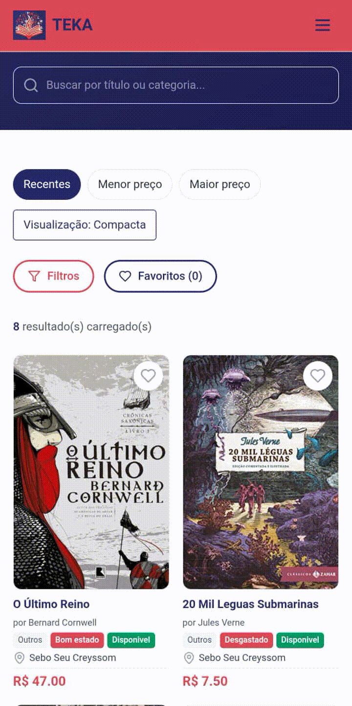
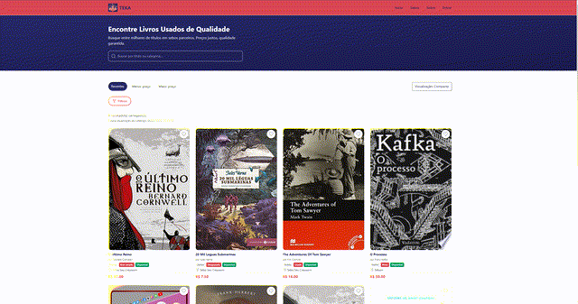

  

# TEKA

Plataforma para conectar leitores e sebos, com foco em catálogo de livros (usados e novos), gestão de estoque por livreiro e experiência de compra simples.

## Status Atual

`Pronto para validação com usuários de teste (Beta controlado)`

Versão de referência: `0.7.0+241`

Escopo recomendado para teste:
- fluxo de comprador (busca, filtros, detalhe, WhatsApp);
- fluxo de livreiro (criação do sebo, cadastro por ISBN/scan, gestão de catálogo);
- fluxo admin (gestão de usuários/sebos/livros + métricas);
- fluxo mobile (scanner, OCR, menu e responsividade).

## Guia de Uso

Acesse o guia completo de operação:

- [Guia de Uso - TEKA](docs/GUIA-USO-TEKA.md)
- [Arquitetura AWS Proposta - AWS re/Start](docs/ARQUITETURA_AWS_RESTART.md)
- [Esboco da Apresentacao - AWS re/Start](docs/ESBOCO_APRESENTACAO_AWS_RESTART.md)

## Linha do Tempo (03/03 a 11/03)

- **03/03**: estrutura inicial do MVP, base de catálogo/sebo/livros e primeiros fluxos de cadastro.
- **04/03**: estabilização técnica de build/deploy e evolução forte do fluxo ISBN/capas/mobile.
- **05/03**: migração de foco para Cloudflare, login Google, roles (comprador/livreiro/admin), favoritos/interesses e PWA/câmera.
- **06/03**: expansão do painel admin, melhorias de catálogo/estoque, OCR e robustez de sessão/cache.
- **07/03**: polimento de UX comprador/livreiro/admin, scan em lote guiado, documentação e compliance.
- **08/03**: refinos visuais finais, melhorias de filtros/home, hardening de segurança (itens 1-6) e ajustes de usabilidade.
- **09/03-11/03**: normalização de cidade/UF, ordenação por proximidade, ajustes de visibilidade e documentação técnica.

## Visão Geral

A TEKA foi desenhada para:

- permitir cadastro rápido de livros por ISBN/câmera;
- suportar múltiplos lotes do mesmo livro (ex.: mesmo ISBN com estados e preços diferentes);
- exibir catálogo unificado para compradores;
- dar controle operacional para livreiro e admin.

## Perfis e Funcionalidades

### Comprador

- catálogo com filtros (categoria, sebo, condição, status, cidade/UF, preço);
- busca por título, autor e ISBN;
- favoritos e lista de interesses;
- visualização de variações de oferta por estado/preço.
- modo claro/escuro com preferência salva no navegador (padrão inicial: modo claro).
- priorização opcional de ofertas próximas (`Ver perto de mim: ON/OFF`) com selo `Na sua cidade` / `No seu estado`.
- na Home, livros sem capa são posicionados no final para manter vitrine visual mais consistente.
- no detalhe do livro, o bloco do sebo está compacto com opção `Ver mais detalhes do sebo`.

### Livreiro

- cadastro manual de livros;
- scanner por código de barras/ISBN;
- **scan em lote** com revisão antes de publicar;
- gestão de estoque (quantidade, status, visibilidade, edição completa e exclusão);
- identificação rápida de itens sem capa (badge `Sem capa`);
- filtro de capa no catálogo do livreiro (`Todos`, `Sem capa`, `Com capa`);
- exportação CSV do catálogo.

### Admin

- visão administrativa de usuários, sebos e livros;
- edição completa de livros e ações de gestão centralizadas;
- fluxo de edição de livros com formulário dedicado e ações explícitas `Salvar` / `Cancelar`;
- gestão de capas com filtros (`Sem capa` / `Com capa`) e troca por ISBN/título;
- controle por role.

## Métricas e Dashboards

- **Livreiro**: cards operacionais + gráficos de status do catálogo e top livros por favoritos.
- **Admin**: visão consolidada da plataforma com usuários por perfil, status de livros, crescimento 7d e ações recentes de auditoria.
- Auditoria no painel Admin mostra por padrão as 5 últimas ações, com opção para expandir o histórico completo.
- Gráficos implementados com `recharts`, mantendo identidade visual do produto.

## Privacidade e Compliance

- dados de comprador são privados por padrão;
- visualização de dados sensíveis restrita ao admin;
- consentimento informado no onboarding de comprador e livreiro;
- referência legal informativa: LGPD (Lei nº 13.709/2018, arts. 7º, 18 e 46) e Marco Civil da Internet (Lei nº 12.965/2014, art. 15).

## Segurança (Hardening)

- proteção de headers de segurança em rotas críticas;
- rate limit em endpoints sensíveis (ex.: OCR);
- limpeza de buckets de rate limit para evitar crescimento indefinido em memória;
- sanitização de erros internos para não expor SQL/infra;
- validação estrita de audience em tokens Google (sem fallback inseguro);
- bloqueio de exposição pública de livros ocultos;
- minimização de dados sensíveis em endpoints públicos de sebo/usuário;
- bloqueio de login/cadastro legados por e-mail em produção (salvo flag explícita);
- trilha de auditoria para ações administrativas e de gestão.

## Fluxos de Cadastro de Livro

1. **ISBN manual**: preenche metadados e capa automaticamente.
2. **Scanner de código de barras**: leitura direta de ISBN.
3. **Fotografar capa e extrair dados**:
   - OCR remoto (OCR.space) com fallback local;
   - busca de sugestões de livro;
   - escolha de capa entre opções encontradas.
4. **Scan em lote (`/batch-scan`)**:
   - leitura guiada (uma leitura por vez com botão `Próximo scan`);
   - cooldown anti-duplicação;
   - som/vibração ao detectar;
   - revisão em fila e publicação em lote.

## Demonstração

<table>
  <tr>
    <td align="center">
      <strong>Mobile</strong> 
      
    </td>
    <td width="40">&nbsp;</td>
    <td align="center">
      <strong>Web/Desktop</strong> 
      
    </td>
  </tr>
</table>

## Stack Técnica

- Frontend: React 19 + TypeScript + Vite + Tailwind
- Roteamento: `wouter`
- Estado de servidor: TanStack Query + tRPC
- Backend: tRPC + Cloudflare Pages Functions
- Banco: Cloudflare D1 (SQLite) + Drizzle ORM
- Deploy: Cloudflare Pages

## Arquitetura de Referência na AWS

Para apresentação acadêmica de uma arquitetura de referência na AWS, foi preparado um documento executivo com:

- módulos da arquitetura;
- responsabilidade de cada serviço;
- justificativa de uso;
- alternativa mais barata;
- estimativa inicial mensal.

Documento:

- [Arquitetura AWS Proposta - AWS re/Start](docs/ARQUITETURA_AWS_RESTART.md)

## Configuração de Ambiente

Crie `.env.local` (não versionado) com as variáveis necessárias para dev/build.

Variáveis importantes de produção (Cloudflare Pages > Settings > Variables and Secrets):

- `OCR_SPACE_API_KEY`
- `TRPC_EXECUTION_MODE`
- `TRPC_UPSTREAM_URL` / `API_UPSTREAM_URL` (quando aplicável)
- `GOOGLE_CLIENT_ID`
- `VITE_GOOGLE_CLIENT_ID`
- `ALLOWED_ORIGINS` (origens permitidas no servidor Express local, separado por vírgula)

## Scripts

- `pnpm dev` - desenvolvimento
- `pnpm check` - validação TypeScript
- `pnpm test` - testes (Vitest)
- `pnpm build` - build de produção
- `pnpm db:push` - geração/aplicação de migrações Drizzle
- `pnpm db:seed` - seed local
- `pnpm db:backfill:location` - backfill de cidade/UF normalizadas (NFD)

## Estrutura de Dados (resumo)

- `books`: título, autor, ISBN, categoria, preço, condição, quantidade, capa
- `sebos`: dados da loja + logística de entrega + plano (`free`/`pro`/`gold`) + slug de vitrine
- `favorites`, `wishlist`, `book_interests`: suporte a descoberta e interesse do comprador
- `audit_logs`: trilha de ações sensíveis (admin/livreiro)

## Planos do Sebo (Free/Pro/Gold)

- Home (`/`) segue como catálogo agregado de todos os sebos.
- Cada sebo possui vitrine própria:
  - Free: `/sebo/:id`
  - Pro/Gold: `/s/:slug`
- Todo sebo nasce em `free` por padrão no cadastro.
- Mudança de plano (`free` <-> `pro` <-> `gold`) é feita pelo admin em **1 ação** no painel.
- Livreiro de sebo `pro/gold` pode ajustar o slug em `Configurações`.
- Ao virar `pro` ou `gold`, a URL personalizada passa a valer imediatamente.
- Recursos avançados são controlados por flags de ambiente:
  - `FEATURE_REVIEWS` (avaliações de sebo);
  - `FEATURE_PUBLIC_SEBO_CONTACT` (exibição pública de contato/endereço quando permitido);
  - `ENFORCE_PLAN_LIMITS` (limites por plano).

## Observações Operacionais

- upload manual de capa está desativado no fluxo Cloudflare-only;
- OCR remoto depende de chave válida no ambiente;
- mudanças de schema no D1 exigem sincronização de migrações/colunas.

## Localização (Cidade/UF) - Notas de Deploy e Qualidade

- Migrações de localização precisam rodar antes do código ir para produção.
- O backend usa `sebos.cityNormalized` e `sebos.stateNormalized` para filtros; sem as colunas, o filtro por cidade/UF quebra.
- Migrações envolvidas: `drizzle/0012_sebo_location_normalized.sql` e `drizzle/0013_sebo_location_normalized_unaccent.sql`.
- O backfill em SQL cobre a maioria dos casos, mas pode não contemplar 100% dos caracteres (ex.: variações de “Ç”).
- Backfill robusto via script (recomendado quando houver dados legados): `pnpm db:backfill:location`.
- Alternativa no ambiente com binding do DB: `sebos.adminBackfillLocation` (requer `ALLOW_ADMIN_BACKFILL_LOCATION=true`).
- O script exige acesso ao DB/binding do ambiente (mesmo contexto do backend) e aplica `normalize("NFD")`.
- Revisão visual rápida recomendada para modo claro/escuro nas telas: Home, Book, MyInterests, Admin.
- `normalizeLocation` está duplicado em client/server; pode virar utilitário compartilhado no futuro.

## Licença

Este projeto está protegido por direitos autorais e possui uso restrito.

É permitido apenas para estudo individual.

Consulte os termos completos em: [LICENSE](./LICENSE.md)

## Autoria

AUTORIA
Toda a implementação técnica do sistema, incluindo frontend, backend, integrações, lógica de programação, estrutura de dados e deploy, foi desenvolvida integralmente por Rafael Garcez.

Este projeto foi desenvolvido no contexto do Trabalho de Conclusão de Curso (TCC) da Escola da Nuvem AWS, turma BRASA0-227.

Retornar à página principal do projeto: [mvp-teka](https://github.com/Garcez7R/mvp-teka)
